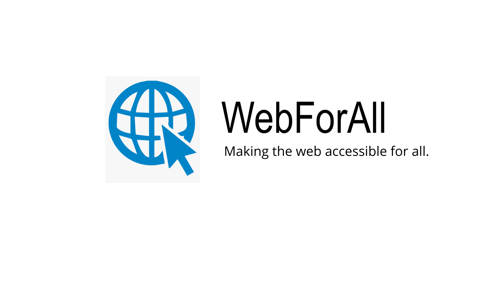

# WebForAll Website

## Inspiration
More than 98% websites on the Internet have been classified as in-accessible according to the 2020 Web Accessibility Annual Report. This is inimical to people with disabilities and restricts involving them within the Internet Community. We are determined to change this. We built WebForAll which can make all websites on the Internet accessible to individuals with accessibility challenges without having the website makers change a bit of their website. 
Making websites accessible for everyone will help improve the quality of life for the disabled community. 

However, we wanted our extension to improve the productivity of non-disabled people. To achieve this, we have added many features that can be used by both the disabled and non-disabled communities.

We named our project WebForAll after our goal, to make the internet truly accesible for all.

We want our users with varied abilities to feel empowered and confident on the Internet just like their more fortunate peers. We want them to feel brave and fearless.

## What it does
We built WebForAll keeping in mind inclusiveness and diversity of the a11y community. Therefore, WebForAll can cater to people with visual impairments, hearing disabilities, cognitive impairments and speech difficulties. 

WebForAll will also increase the productivity of non-disabled people using it. 

WebForAll can run on all Blink based browsers - Chrome, Edge, Opera, Vivaldi, Brave and Chromium. It can do the following:

### WebForAll Voice Based Actions
Smart voice based assistant to do the following:

- Open Google, Facebook, YouTube, Wikipedia.
- Google anything for you.
- Play a song on YouTube.
- Translate from any language to English.
- Google Map directions from any location to any other location in the world just by naming the two cities.
### Color Blind Aid
We wanted WebForAll to be for all and hence we built in color blindness features. Color blindness has affected more than 300 million people in the world but is still not talked about openly. WebForAll allows users to emphasize link in multi-colors thereby catering to all three types of color blindness namely - red-green, blue-yellow and total color blindness. We also added in a feature to add text strokes to paragraph texts in a user-defined color to enable color-blind users to make out text.

### Font Type
WebForAll can dynamically change the font type of webpages without requiring reload. Support Arial, Verdana, Impact, Comic Sans fonts. Additional support for Sign Language font.

### Focus Mode
Individuals suffering from schizophreniac, dyslexic and other cognitive impairments may find it difficult to center their focus on the text of the webpage. With Focus mode users can veil all images of the webpage and better focus on what's important. In pages with a high amount of text content users with difficulty focussing may find themselves lost where they were reading. WebForAll provides users the ability to highlight words in a paragraph corresponding to where they were reading. This also helps in increasing the individual per-word-visibility.

### Text-to-speech
Not all users may be able to read. We built the text-to-speech feature to enable users to be a part of the webpage by listening to it. WebForAll can read out text highlighted by the users thereby increasing the inclusivity and diversity of every webpage on the Internet.

### Text Zoomer
Visually impaired users (and sometimes users with a regualar eyesight as well!) may find it hard to read text written on a webpage. There is little provision for increasing text size without zooming in the entire page. WebForAll allows users to manipulate text sizes on webpages to suit to their needs while still maintaining the zoom levels of other components within the webpage.

### Font Color
Internet users suffering from photophobia (light sensitivity) might find it strenous to read pages with bright font color and low font-bacground contrast. WebForAll aids these users by enabling them to change the font color of any text within a webpage without requiring a refresh thereby keeping users where they were on the webpage!

### Magnifier
Few web developers take into consideration the a11y guidilines for displaying text. Fewer web developers consider maintaining those guidelines for images. We built the magnifier feature within WebForAll that allows provides users with a magnifying glass atop images on hovering so that disabled users don't feel left out.

## Challenges we ran into
Syncing user configuration across different tabs without refreshing any of them was really challenging. We accomplished this by storing each configuration within the extension's persistent storage which is available across different tabs and added an activeTab listener so that the extension would know whenever the user changes their tab.

Another challenging part to build was the voice recognition module. Allowing WebForAll to recognize user voices across different accents and speeds was difficult but we were able to overcome this challenge.

### Accomplishments that we're proud of
Before this weekend, none of us had ever built a Chrome extension. We're proud to build WebForAll as our first Chrome extension.

## What we learned
Apart from learning to build an extension, we learned how Chrome extensions work across a variety of browsers using the Blink browser engine. We also became aware of how extensions achieve cool things by manipulating the browser DOM.

## What's next for WebForAll
We would love to add newer features to WebForAll and release it as a full fledged accessibilty and productivity freemium product to our users!

##### Icons from https://iconmonstr.com

